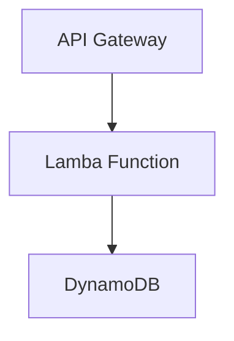

# Bolt App Backend Terraform

This project bootstraps a serverless backend for a Bolt app using AWS Lambda, API Gateway, and DynamoDB. It uses pre-built Terraform modules to simplify deployment.

## Architecture



## DynamoDB Table Details

The backend relies on a DynamoDB table to store and retrieve your application's data.

- **Table Name:** Configurable, default is `bolt-app-store`.
- **Partition Key:** Typically `id` (string).
- **Billing Mode:** By default, `PAY_PER_REQUEST` for on-demand usage, making it cost-effective for low traffic.
- **Where to Find It:** After deployment, you can find the DynamoDB table in the AWS Management Console under the DynamoDB service in the region you deployed (`us-east-1` by default).

### More Info
The table is created and managed through a Terraform module providing options such as:
- Setting billing mode (on-demand or provisioned)
- Defining primary keys and attributes
- Enabling autoscaling (disabled by default)
- Additional configuration like encryption and indexes can be added in the module inputs.

For precise configuration, see the `variables.tf` file where you can override parameters such as `dynamodb_table_name`, `dynamodb_hash_key`, and `dynamodb_billing_mode`.

## Prerequisites

- Terraform >= 1.0
- AWS CLI configured with appropriate permissions

## Usage

1. Place your Lambda code in `src/app.py` (implement `lambda_handler(event, context)`).
2. Initialize Terraform:

   ```bash
   terraform init
   ```

3. Review the plan:

   ```bash
   terraform plan
   ```

4. Apply changes:

   ```bash
   terraform apply
   ```

5. Access the backend at the `api_invoke_url` output.

## File Overview

- provider.tf      : AWS provider configuration
- variables.tf     : Input variables definitions
- main.tf          : Core resources and module instantiations
- outputs.tf       : Exposed outputs
- terraform.tfvars : Variable values for this environment
- README.md        : Project overview and instructions

## Customization

- Adjust `variables.tf` defaults or override via `terraform.tfvars`.
- Add more API methods or resources in `main.tf`.
- Extend DynamoDB schema via module inputs.
